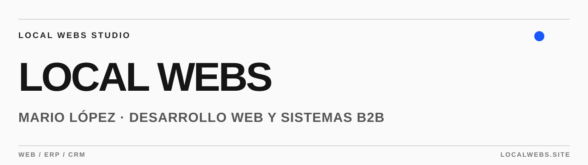

  

<h1 align="center">Hola, soy Mario López.</h1>

  Desarrollador web y fundador de <strong>LocalWebs</strong>. 
  Creo webs, aplicaciones y sistemas ERP/CRM a medida para empresas B2B.

  <a href="https://localwebs.site/">Ver LocalWebs</a> ·
  <a href="https://localwebs.site/es/work/">Proyectos</a> ·
  <a href="mailto:hola@localwebs.site">Escríbeme</a>

---

### Lo que construyo

- **Webs con propósito:** experiencias rápidas, claras y pensadas para convertir.
- **Software para empresas:** aplicaciones y sistemas ERP/CRM adaptados a procesos reales.
- **Producto de principio a fin:** diseño, desarrollo y evolución continua.

### Tecnologías

`React` · `TypeScript` · `JavaScript` · `HTML` · `CSS` · `PHP`

### Trabajo seleccionado

| Proyecto | Qué es | Enlaces |
| :-- | :-- | :-- |
| **INAC BCN** | Web para una empresa de construcción y reformas. | [Web](https://inacbcn.com/) · [Caso](https://localwebs.site/es/work/inac-bcn/) |
| **Tot Immobles San Narciso** | Presencia digital para una inmobiliaria de proximidad. | [Web](https://totimmosannarciso.es/) · [Caso](https://localwebs.site/es/work/tot-immobles/) |
| **EcoGlide** | Experiencia de comercio electrónico para movilidad. | [Web](https://ecoglide.es/) · [Caso](https://localwebs.site/es/work/ecoglide/) |
| **Instalaciones Konex** | Web para una empresa de instalaciones técnicas. | [Web](https://ikonex.es/) · [Caso](https://localwebs.site/es/work/ikonex/) |

### Hablemos

¿Tienes un proyecto web o una idea de software para tu empresa? [Cuéntame qué necesitas](mailto:hola@localwebs.site) o visita [localwebs.site](https://localwebs.site/).
